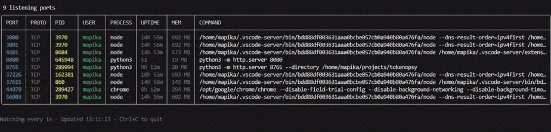

# portview

[](https://github.com/mapika/portview/actions/workflows/ci.yml)
[](https://crates.io/crates/portview)

See what's on your ports, then act on it.

A diagnostic-first port viewer for Linux, macOS, and Windows. One command shows you what's listening, who owns it, how long it's been running, and lets you act on it. With `--docker`, Docker containers appear as first-class rows - inspect, stop, restart, or tail logs right from the TUI.

~1 MB single binary. Zero runtime dependencies.

<p align="center">
  
</p>

## Install

```bash
# One-liner (Linux/macOS)
curl -fsSL https://raw.githubusercontent.com/mapika/portview/main/install.sh | sh

# PowerShell (Windows)
irm https://raw.githubusercontent.com/mapika/portview/main/install.ps1 | iex

# Homebrew
brew install mapika/tap/portview

# Cargo
cargo install portview
```

Or grab the binary from [Releases](https://github.com/mapika/portview/releases).

## Quick start

```bash
portview                      # list all listening ports
portview 3000                 # inspect port 3000 in detail
portview node                 # find ports by process name
portview watch                # interactive TUI
portview watch --docker       # TUI with Docker containers
portview kill 3000 --force    # kill what's on port 3000
```

## Usage

### Scan

```
$ portview
╭──────┬───────┬───────┬──────┬──────────┬─────────┬────────┬─────────────────────────────────────╮
│ PORT │ PROTO │ PID   │ USER │ PROCESS  │ UPTIME  │ MEM    │ COMMAND                             │
├──────┼───────┼───────┼──────┼──────────┼─────────┼────────┼─────────────────────────────────────┤
│ 3000 │ TCP   │ 48291 │ mark │ node     │ 3h 12m  │ 248 MB │ next dev                            │
│ 5432 │ TCP   │ 1203  │ pg   │ postgres │ 14d 2h  │ 38 MB  │ /usr/lib/postgresql/16/bin/postgres │
│ 6379 │ TCP   │ 1198  │ redis│ redis    │ 14d 2h  │ 12 MB  │ redis-server *:6379                 │
│ 8080 │ TCP   │ 51002 │ mark │ python3  │ 22m     │ 45 MB  │ uvicorn main:app --port 8080        │
╰──────┴───────┴───────┴──────┴──────────┴─────────┴────────┴─────────────────────────────────────╯
```

Use `--all` to include non-listening connections. Use `--wide` to show full commands without truncation.

### Inspect a port

```
$ portview 3000

Port 3000 (TCP) - node (PID 48291)
  Bind:     *:3000
  Command:  next dev
  User:     mark
  Started:  3h 12m ago
  Memory:   248 MB
  CPU time: 14.3s
  Children: 3
  State:    LISTEN

  Kill process 48291? [y/N]
```

### Search by process name

```bash
portview node        # matches process name and command
portview python
```

### Docker integration

Add `--docker` to any command. Docker-published ports that have no visible host process appear as their own rows:

```
$ portview --docker
╭──────┬───────┬───────┬────────┬──────────┬────────┬────────┬───────────────────────────────────╮
│ PORT │ PROTO │ PID   │ USER   │ PROCESS  │ UPTIME │ MEM    │ COMMAND                           │
├──────┼───────┼───────┼────────┼──────────┼────────┼────────┼───────────────────────────────────┤
│ 3000 │ TCP   │ 48291 │ mark   │ node     │ 3h 12m │ 248 MB │ next dev [docker:web]             │
│ 5432 │ TCP   │ 1203  │ pg     │ postgres │ 14d 2h │ 38 MB  │ /usr/lib/postgresql/16/bin/post…  │
│ 8080 │ TCP   │ -     │ docker │ pv-nginx │      - │      - │ nginx:alpine :8080->80/tcp        │
╰──────┴───────┴───────┴────────┴──────────┴────────┴────────┴───────────────────────────────────╯
```

- Host processes with a Docker mapping get a `[docker:<name>]` tag
- Docker-only ports (no host PID) show as synthetic rows with `PID -`
- `portview 8080 --docker` shows container detail with image info
- `portview nginx --docker` finds containers by name
- Works in all modes: scan, inspect, search, watch, and JSON

### Kill

```bash
portview kill 3000          # SIGTERM (Unix) / TerminateProcess (Windows)
portview kill 3000 --force  # SIGKILL
```

> On Windows, kill always force-terminates via `TerminateProcess`.

### Watch mode (interactive TUI)

```bash
portview watch               # interactive TUI, refreshes every 1s
portview watch 3000          # watch a specific port
portview watch node          # filter by process name
portview watch --docker      # show Docker containers as rows
portview watch --json        # streaming JSON (no TUI)
```

#### Keybindings

| Key | Action |
|-----|--------|
| `j`/`k`, `↑`/`↓` | Navigate rows |
| `g`/`G`, `Home`/`End` | Jump to first/last |
| `Enter` | Inspect selected port |
| `d`/`D` | Kill process **or** manage Docker container |
| `/` | Filter across all columns |
| `<`/`>`, `r` | Cycle sort column, reverse direction |
| `1`-`8` | Sort by column N |
| `a` | Toggle all/listening-only |
| `q`, `Esc`, `Ctrl+C` | Quit |

**On a Docker row**, `d` opens a container management popup with **Stop**, **Restart**, and **Logs** actions. On a host process row, `d`/`D` opens the kill confirmation popup (SIGTERM / SIGKILL).

### JSON

```bash
portview --json                                          # all ports
portview --docker --json                                 # with Docker ownership
portview --docker --json | jq '.[] | {port, process, docker}'
portview watch --json --docker                           # streaming
```

### Custom colors

```bash
PORTVIEW_COLORS="port=red,pid=magenta,command=bright_cyan" portview
```

Columns: `port`, `proto`, `pid`, `user`, `process`, `uptime`, `mem`, `command`

Colors: `red`, `green`, `blue`, `cyan`, `yellow`, `magenta`, `white`, `bold`, `dimmed`, `bright_*`, `none`

Watch mode uses an RGB palette by default. Set `PORTVIEW_COLORS` to override, or `--no-color` to disable.

## How it works

All process and port data is read directly from the OS - no shelling out to `lsof`, `ss`, or `netstat`.

| Field | Linux | macOS | Windows |
|-------|-------|-------|---------|
| Port & protocol | `/proc/net/tcp{,6}`, `udp{,6}` | `proc_pidfdinfo` | `GetExtendedTcp/UdpTable` |
| PID | inode→pid via `/proc/*/fd/` | `proc_listpids` | Included in socket table |
| Process name | `/proc/<pid>/comm` | `proc_pidpath` | `QueryFullProcessImageNameW` |
| Command | `/proc/<pid>/cmdline` | `proc_pidpath` | `QueryFullProcessImageNameW` |
| User | `/proc/<pid>/status` → `getpwuid` | `proc_pidinfo` → `getpwuid` | `OpenProcessToken` → `LookupAccountSidW` |
| Uptime | `/proc/<pid>/stat` starttime | `proc_pidinfo` start time | `GetProcessTimes` |
| Memory (RSS) | `/proc/<pid>/status` VmRSS | `proc_pidinfo` resident size | `K32GetProcessMemoryInfo` |
| CPU time | `/proc/<pid>/stat` utime+stime | `proc_pidinfo` user+system | `GetProcessTimes` |
| Children | `/proc/<pid>/task/*/children` | `proc_listchildpids` | `CreateToolhelp32Snapshot` |

Docker integration queries `docker ps` when `--docker` is passed.

## Why portview

| Tool | Limitation |
|------|-----------|
| `lsof -i :3000` | Different flags per OS, cryptic output, slow |
| `ss -tlnp` | Powerful but unreadable, no uptime/memory |
| `fkill-cli` | Requires Node.js, kill-first not diagnostic-first |
| `killport` | Kill-only, no inspection |
| `procs` | General process viewer, not port-centric |

portview is diagnostic-first: understand what's on your ports, then act.

## Building from source

```bash
git clone https://github.com/mapika/portview
cd portview
cargo build --release
```

## Limitations

- **Linux:** Needs read access to `/proc/<pid>/fd/`. Other users' processes require `sudo`.
- **macOS:** Other users' processes may require `sudo`.
- **Windows:** Some system processes may not be accessible. Kill always force-terminates. Run as Administrator for full visibility.
- **Docker:** Requires the `docker` CLI and access to the Docker daemon.

## License

MIT
